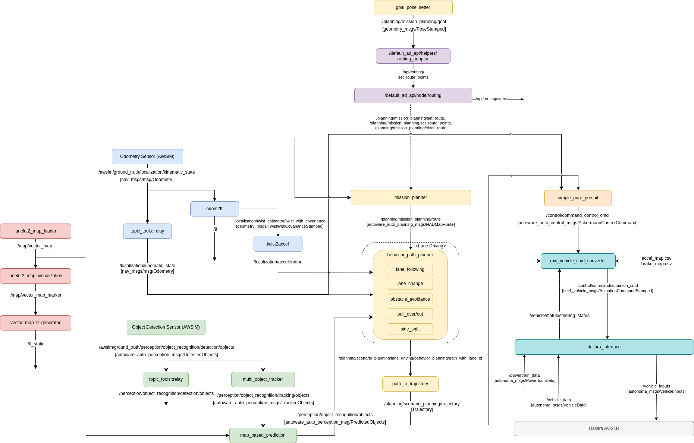

# Customizing Autoware

本大会では、自動運転ソフトウェアAutowareをベースとした実装を用意しております．

本ページでは、その背景と説明に加えて、どのように本実装を活用できるかの紹介を行います．

前回の[インテグレーション大会](https://www.jsae.or.jp/jaaic/2023_contest.php)では、デフォルトのAutowareから機能を絞り、ノード数を減らした[縮小構成のAutoware「Autoware-Mini」を起動できるLaunchファイルを提供](https://github.com/AutomotiveAIChallenge/aichallenge2023-integ/blob/main/docker/aichallenge/aichallenge_ws/src/aichallenge_submit/aichallenge_submit_launch/launch/autoware_mini_awsim.launch.xml)しました．その際の、背景や用意した意図については、[前大会のドキュメント](https://automotiveaichallenge.github.io/aichallenge2023-integ/customize/index.html#autoware-mini)をご覧ください．

今回のシミュレーション大会では、Autowareの部分的な活用や自由自在な取り込みを可能にするため、[AWSIMとの利用を想定した最小構成の「Autoware-Micro」を用意](https://github.com/AutomotiveAIChallenge/aichallenge2023-racing/blob/main/docker/aichallenge/aichallenge_ws/src/aichallenge_submit/aichallenge_submit_launch/launch/autoware_micro_awsim.launch.xml)しました．
 

## Autoware-Microの背景

### Autowareを利用する時の課題

デフォルトのAutowareでは様々な走行環境に対応するため、たくさんのノードから構成されています．

Autowareの公式ドキュメンテーションでは、[Autowareを構成するROSノードの構成図](https://autowarefoundation.github.io/autoware-documentation/main/design/autoware-architecture/node-diagram/)を見ることもできます．以下に現時点の図を示します．

自動運転に関わる各コンポーネントで多種多様な機能を揃えており、難易度の高い走行環境にも対応できるように作られています．

一方、その複雑な構成を理解し、各パラメータの意味や調整の仕方、モジュールの切り替え・入れ替えなどを行うことが必ずしも容易ではなくなっています．

### Autoware-Miniの用意

そのため、前回のインテグレーション大会では、デフォルトのAutowareから機能を絞り、ノード数を減らした[縮小構成のAutoware「Autoware-Mini」を起動できるLaunchファイル](https://github.com/AutomotiveAIChallenge/aichallenge2023-racing/blob/main/docker/aichallenge/aichallenge_ws/src/aichallenge_submit/aichallenge_submit_launch/launch/autoware_mini_awsim.launch.xml)を用意しました．

Autoware-Miniのノード図を以下に示します．ノード数が格段と減り、基本的な自動走行を可能とする機能のみが揃っていることが分かります．

Autoware-Miniの特徴としては、以下が挙げられます．

- ほぼ全てのノードの起動を直接1つのLaunchファイルから行っている．既存のAutowareでは、Launchファイルが何重にも分かれており、実際にノードが起動する箇所に辿り着くまでLaunchファイルをいくつも辿っていく必要がある．
- パラメータを直接ノード起動時に書き込んでいるため、どのパラメータがどのノードで必要なのかを簡単に追うことができる．
- 各ノードの入出力となるROSトピック名も直接ノード起動時に`remap`しているため、トピック名も簡単に変えられる．

このAutoware-Miniをベースに自動運転ソフトを書くことで、以下のようなことができます．

- シンプルな構成となっているため、Autowareの中身をより深く理解できる
- 自作のモジュールをAutowareのものと簡単に入れ替えることができ、機能の改善に取り組める
- パラメータを変更した場合のシステム全体の動作への影響が分かりやすい
- 今回のAutoware-Miniには含まれていない既存のAutowareのノードを追加することもできる

## Autoware-Microの用意

今回のシミュレーション大会では、高速での自動運転レーシングを競技としており、既存のAutowareをそのまま使うというよりは、Autowareを実装例のベースとして、参加者の皆様に拡張・カスタマイズして頂く想定でいます．

また、より多くの参加者に挑戦して頂けるよう、参加に必要なPCのスペックを広めに取れるよう配慮しております．

そのような背景の下、Autoware-Miniを改変し、「Autoware-Micro」として以下を実現しようとしています．

- Autoware-Miniから更にノード数を絞り、カスタマイズしやすいシンプルな構成とする．
- LocalizationやPerceptionでAWSIMから直接Ground Truthを出すことにより計算負荷の高い処理を省略し、本大会の競技内容にフォーカスできるようにし、より多くのPCスペックに対応できるようにする．
- AWSIMでのレーシング車両に対応できるよう新しくVehicle Interfaceを追加する．

このように、Autowareの部分的な活用や自由自在な取り込みを可能にするため、[AWSIMとの利用を想定した最小構成の「Autoware-Micro」を用意](https://github.com/AutomotiveAIChallenge/aichallenge2023-racing/blob/main/docker/aichallenge/aichallenge_ws/src/aichallenge_submit/aichallenge_submit_launch/launch/autoware_micro_awsim.launch.xml)しました．

Autoware-Microのノード図は以下の通りとなっています．

Autoware-MicroのAutoware-Miniに比べての各コンポーネントの変更点・特徴としては、以下が挙げられます．

- Localization：AWSIMから自己位置のGround Truthを出力することにより、自己位置推定処理を一部省略．
- Perception：AWSIMから物体認識結果のGround Truthを出力することにより、センシングや物体認識処理を省略する一方、物体の行動予測などにフォーカスできるようにした．
- Planning：behavior_velocity_plannerやobstacle_stop_plannerなどを省略し、出力経路から走行trajectoryを直接出力するように変更．
- Control：制御の1つの実装例としてsimple_pure_pursuitを用意．
- Vehicle：raw_vehicle_cmd_converterでControl出力を車両制御信号に変換し、AWSIMのレーシング車両とは車両インターフェイス「dallara_interface」を用いて接続．

## Autoware-Microの活用方法

Autoware-Microを活用することにより、本大会での課題となる：

1. NPC車両の行動予測
2. 追い抜きやカーブなどの戦略的な経路計画
3. 高速での車両制御

に集中して取り組むことができるようになります．

また、Autoware-Microの実装例を参考にしながら、Autowareのアーキテクチャとは少し異なる実装方法を試したり、新しくカスタムのノードを作成・導入したりすることができます．

独自のノードの実装を取り入れることにより、走行性能を向上させ点数を伸ばすことができます．

例えば、以下のような構成を考え、「Planning」と「Control」をそれぞれ実装して取り組んだり、「Planning & Control」を両方担うノードを実装できます．

ルートの入力と車両インターフェイス出力のROSトピックさえ合っていれば自由にカスタマイズして頂けます．

## How to customize and use Autoware packages

1. 元のパッケージをコピーして、下記を変更
     * パッケージ名
     * フォルダ名
     * コード
    *  package.xml
    * CMakeLists.txt
2. aichallenge_submitの中に配置
3. autoware_universe_launchから呼び出されるlaunchファイルを変更  
    * 参考例：pose_initializer_custom（ autoware_universe_launch/tier4_localization_launch/launch/util/util.launch.xmlから呼び出しております）
