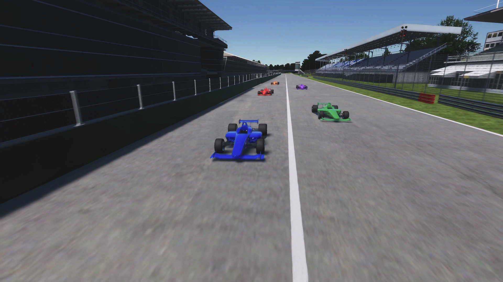
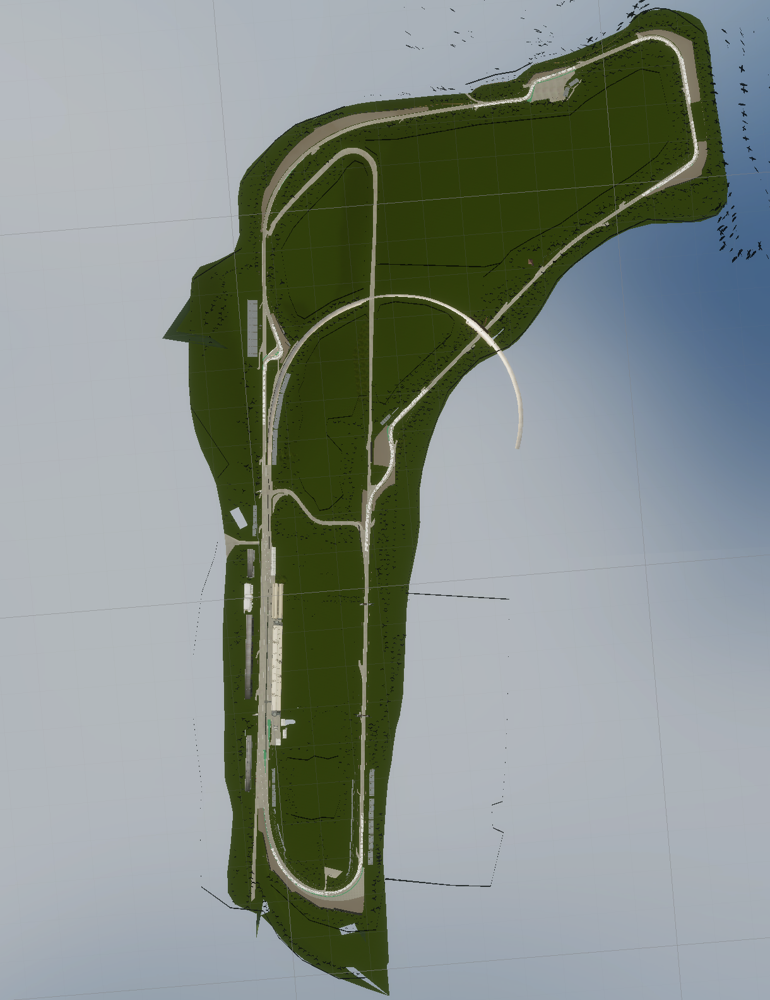
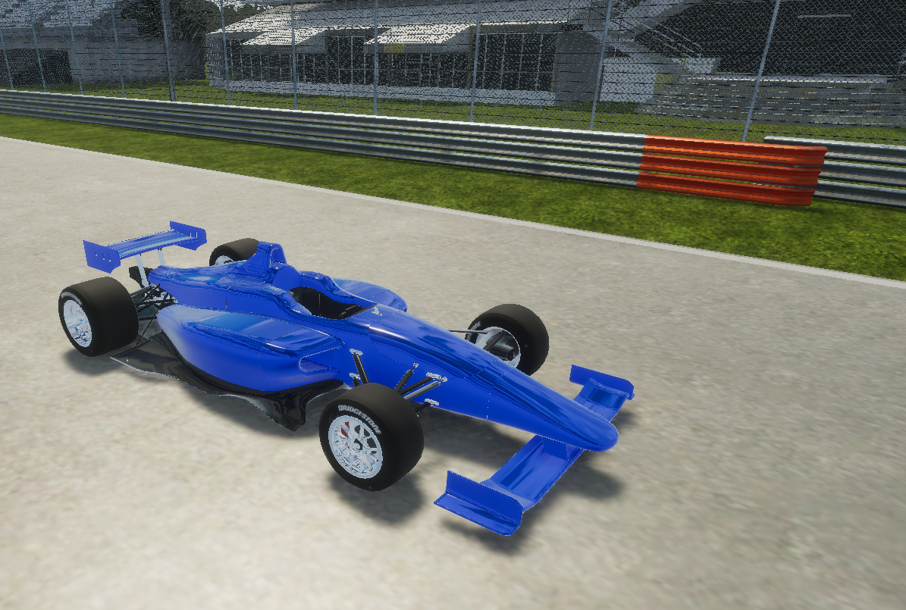
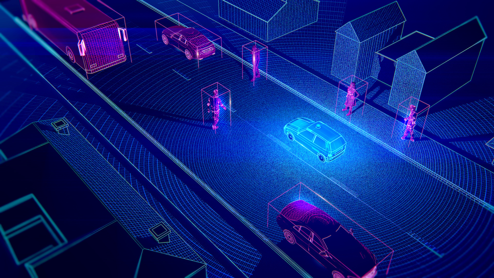
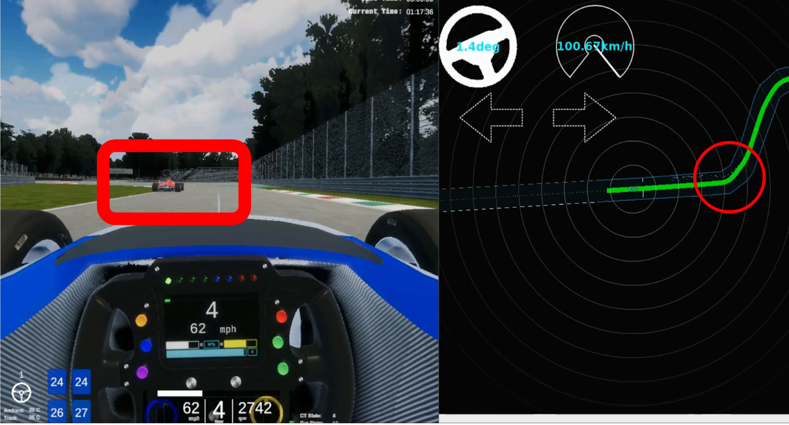
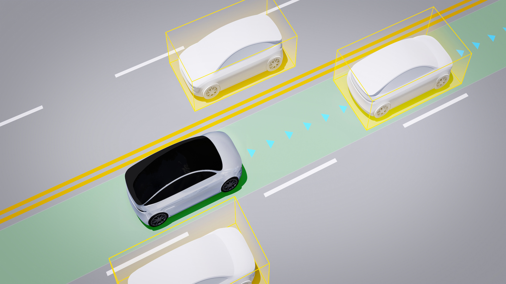
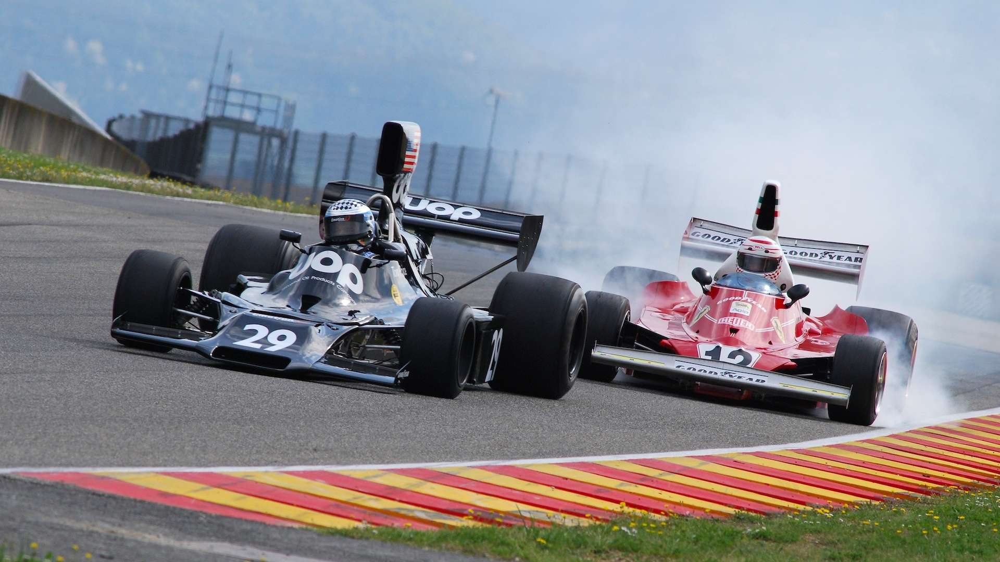

## 自動運転AIチャレンジ2023 (シミュレーション)

## 大会コンセプト

CASEと呼ばれる新たな技術領域が自動車業界の競争の中心となる中、AIやITの技術者が不足しており、 自動車業界全体で急速に必要性が高まっています。
今後の自動車業界を牽引する技術者の発掘育成の為の新たな取り組みとして、自動運転におけるAI技術 を競う国際的な競技を開催します。
産官学が協力して行うこの競技を起点に、自動車産業のさらなる発展に寄与する枠組みの構築を目指します。

## Japan Automotive AI Challenge 2023(Simulation)目的
極限状態にて自動車の走行性能が問われるモータースポーツは、技術的課題を生み出すことで自動車の性能向上・発展に貢献してきました。 自動運転AIチャレンジ2023（シミュレーション）は、End to End(E2E)シミュレーション環境におけるレースをテーマに、安全かつ高速に走行できる自動運転技術の開発への貢献を目標としています。

レースでの自動運転には、横滑り、空気抵抗、車両の応答特性を考慮した制御技術、他車両の追跡や行動予測など、多様な技術要素が関わっています。本大会は参加者に、これらの要素を取り入れた、戦略的な走行計画と高度な車両制御機能を備えた自動運転ソフトウェア開発に取り組み、知見を共有する機会を提供します。このChallengeを通じて新しい技術を身に着けた技術者たちが、自動車業界の技術革新に寄与することを期待しています。

## 自動運転AIチャレンジ2023 (シミュレーション) 概要

>[!Video https://drive.google.com/file/d/1SBAKCx-4Y_PlF61QSCsIEXPhmKUTF961/view?usp=drive_link]

本大会では、予め配布されたソフトウェアを使用して、上記のような動画で走行することが可能です。このソフトウェアを用いて、後述の課題に沿った改善を行ってください。

## 自動運転技術コンペティションと特別賞

参加者の皆様には、[Autoware.Universe](https://github.com/AutomotiveAIChallenge/autoware.universe)をベースとした自動運転ソフトウェアで、安全に走行しながらレースに勝利することを目指していただきます。また、本大会のコミュニティの成長を促し、参加者に役立つ知見を共有する目的で、以下の特別賞を設けます。詳しくは[開催概要](https://www.jsae.or.jp/jaaic/2023_simulation.php)のページをご覧ください。
1. ボランティアでOSSへの貢献をしていただいた方やコミュニティの拡大に貢献していただいた方を表彰するコミュニティ貢献賞
2. AIChallengeを通した積極的な取り組みの発信を奨励するためにプラチナスポンサーの方に投票いただくスポンサー賞

## 走行コースとライバル

|  |  |
| :-------------------------------------------------: | :--------------------------------------------------------: |
|                 MonzaTrack at AWSIM                 |                  MonzaTrack at vector map                  |

本大会の走行コースは[MonzaTrack](https://www.google.com/maps/search/MonzaTrack)になります。全長 約5.8kmで、ロングストレートやヘアピンカーブを含む複雑な形状をしております。このサーキットをテーマとしたコースを、複数台のライバル車とともに走行します。ライバル車はあなたの自動運転車に合わせて加減速やコース変更をするため、戦略的な経路計画が求められます。

## 使用する車両

本大会ではIndyAutonomousChallengeで使用する車両を用いて大会を行っています。

|  |  |
| :-----------------------------------------------: | :------------------------------------------------: |
|                  simulation car                   |                      indy car                      |

## 自動運転AIチャレンジ2023 (シミュレーション) - 3つのチャレンジ

### Challenge 1: Robust Perception

|  |  |
| :----------------------------------------------------------------------: | :---------------------------------------------------: |
|                          sensing and perception                          |                perception at sim race                 |

第1のチャレンジでは、シミュレータが提供する他車両の認識データを基に、これらの車両の将来の行動を予測することが求められます。自動運転車には高い安全性が必要であり、衝突を避けるためには周囲360度に存在する他の車両をセンサーデータを通じて認識し、それらの動きを予測することが不可欠です。本コンペティションでは、参加者が行動予測に集中できるように、他車両の認識情報として正確なデータ（真値）を提供します。

具体的には以下の点を改善していただくことが可能です。

- 他車両追跡: 参加者は、センサーデータを利用して他車両の位置と動きを追跡します。このプロセスには、センサーからの情報を解析し、周囲の車両を正確に特定することが含まれます。
- 行動予測: トラッキングされた車両のデータに基づき、将来の行動を予測します。この予測は、衝突回避や安全な運転戦略の策定に不可欠です。

### Challenge 2: Strategic Route Planning

|  |  |
| :--------------------------------------------------------------------: | :---------------------------------------------------: |
|                       real environment planning                        |                    route planning                     |

第2のチャレンジは戦略的な経路計画です。他車より速く走行するためには、認識結果を用いて刻々と変わる周辺環境を処理し、常に最適なルートを追求する必要があります。

具体的には以下の点を改善していただくことが可能です。

- 動的な状況への対応:
レース中の状況は常に変化します。他の車がどのように動くか、路面の状態がどう変わるかなど、これらの要因に迅速かつ効果的に対応することが求められます。
- 最適ルートの追求
他の車より速く走行するためには、これらの情報を基に、常に最適なルートを見つけ出し、追求することが必要です。これには、カーブの取り方、加速と減速のタイミング、オーバーテイクのチャンスの見極めなどが含まれます。

### Challenge 3: Control in High-Speed Driving

|  |  |
| :-------------------------------------------------------------------: | :---------------------------------------------------: |
|                          high speed control                           |           high speed control at simulation            |

第3のチャレンジは、戦略的で複雑な経路に沿った走行を可能にする、高速域に対応した制御モジュールの開発です。レースで勝利を収めるためには、最適な経路計画を実現する制御技術が必要不可欠です。本コンペティションでは、参加者が車両制御に集中できるように、自己位置推定結果として正確なデータ（真値）を提供します。

具体的には以下の点を改善していただくことが可能です。

- 高速域での制御
レース中、特に200km/h程度の高速で走行する際には、ギアの変速などを含めた車両の制御が非常に重要になります。高速での運転は、低速時と比べて車両の挙動が大きく変わるため、より精密な制御が必要です。
- 車両インターフェースの開発
このチャレンジでは、高速域での走行を可能にするために、特化した制御モジュールの開発が求められます。このモジュールは、実際の車両挙動を綿密に模倣したシミュレータを使った車両のアクセル、ブレーキ、ステアリングなどを適切に制御することが求められます。

### 評価基準について

本大会では、速く、安全にゴールにたどり着くことを目標にしています。そのため、参加者の自動運転ソフトウェアによる走行は以下の3つの観点で評価されます。スコアリングとルールの詳細は、ルールのページをご覧ください。

1. 走行距離 – コースのゴールにたどり着くこと
2. 安全性 – 衝突や経路逸脱なく走行すること
3. スピード – 短いタイムでゴールまで走行すること

### 開発環境について

- 開発環境としてUbuntu 22.04 が動作するパソコンを参加者様でご準備いただく必要があります。
- 開発したコードを提出していただき、クラウド環境で採点を行います。

- 競技用のレポジトリや競技内容の詳細は、11月初旬の公開を予定しております。
