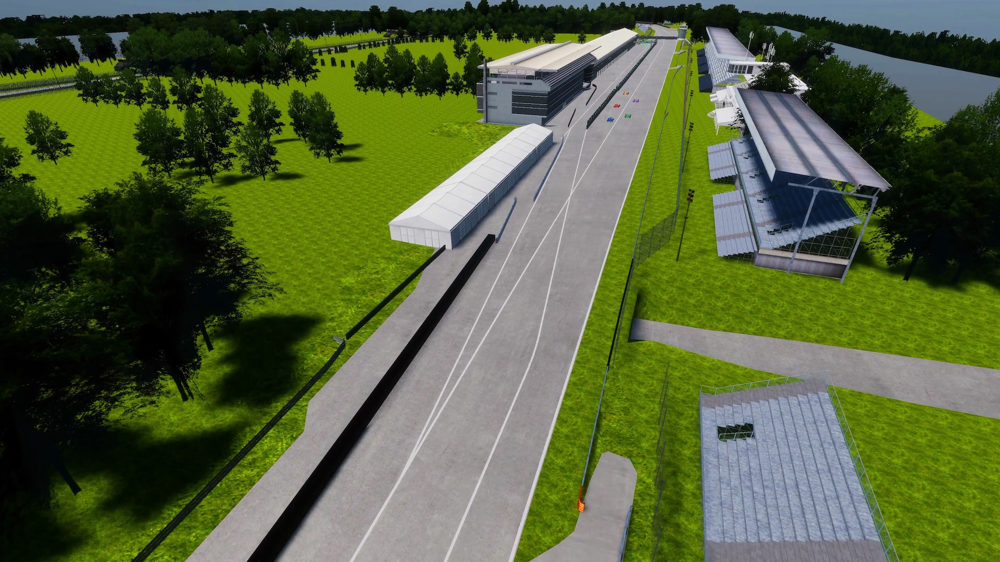

## 自動運転AIチャレンジ2023 (シミュレーション)

モータスポーツをテーマにした自動運転ソフトウェア開発コンペティション、自動運転AIチャレンジ2023 (シミュレーション) を開催いたします。参加者の皆様には、[Autoware.Universe](https://github.com/autowarefoundation/autoware.universe)をベースとした自動運転ソフトウェアを開発し、End to Endシミュレーション空間(AWSIM)を走行するレーシングカーにインテグレートしていただきます。開発した自動運転ソフトウェアで、安全に走行しながらレースに勝利することが目標です。

## 大会コンセプト

CASEと呼ばれる新たな技術領域が自動車業界の競争の中心となる中、AIやITの技術者が不足しており、 自動車業界全体で急速に必要性が高まっています。
今後の自動車業界を牽引する技術者の発掘育成の為の新たな取り組みとして、自動運転におけるAI技術 を競う国際的な競技を開催します。
産官学が協力して行うこの競技を起点に、自動車産業のさらなる発展に寄与する枠組みの構築を目指します。

## 自動運転AIチャレンジ2023 (シミュレーション) 概要

End to End(E2E)シミュレーション環境におけるレースをテーマに、安全かつ高速に走行するための自動運転技術の開発への貢献を目標としています。

レースでの自動運転には、横滑り、空気抵抗、車両の応答特性を考慮した制御技術、他車両の追跡や行動予測など、多様な技術要素が関わっています。本大会は参加者に、これらの要素を取り入れた、戦略的な走行計画と高度な車両制御機能を備えた自動運転ソフトウェア開発に取り組み、知見を共有する機会を提供します。このChallengeを通じて新しい技術を身に着けた技術者たちが、自動車業界の技術革新に寄与することを期待しています。

## 自動運転AIチャレンジ2023 (シミュレーション) - 3つのチャレンジ
### Challenge 1: Robust Perception

自動運転車には高い安全性が求められます。衝突を回避するための第1歩は、センサーデータから360度取り囲む他の車を認識し、その動きを予測することです。第1のチャレンジは、高速かつロバストな認識機能の開発です。

### Challenge 2: Strategic Route Planning

第2のチャレンジは戦略的な経路計画です。他車より速く走行するためには、認識結果を用いて刻々と変わる周辺環境を処理し、常に最適なルートを追求する必要があります。

### Challenge 3: Control in High- Speed Driving

レースで勝利を収めるためには、最適な経路計画を実現する制御技術が必要不可欠です。第3のチャレンジは、戦略的で複雑な経路に沿った走行を可能にする、高速域に対応した制御モジュールの開発です。

## 競技説明

参加者の皆様には、[Autoware.Universe](https://github.com/autowarefoundation/autoware.universe)をベースとした自動運転ソフトウェアを開発し、End to Endシミュレーション空間([AWSIM](https://github.com/tier4/AWSIM))を走行するレーシングカーにインテグレートしていただきます。開発した自動運転ソフトウェアで、安全に走行しながらレースに勝利することが目標です。

### 走行コースとライバル

本大会の走行コースは全長 約5.8kmで、ロングストレートやヘアピンカーブを含む複雑な形状をしております。このサーキットをテーマとしたコースを、複数台のライバル車とともに走行します。ライバル車はあなたの自動運転車に合わせて加減速やコース変更をするため、戦略的な経路計画が求められます。

### 評価基準について

本大会では、速く、安全にゴールにたどり着くことを目標にしています。そのため、参加者の自動運転ソフトウェアによる走行は以下の3つの観点で評価されます。スコアリングとルールの詳細は、後日公開するこのドキュメンテーションで公開予定です。

1. 走行距離 – コースのゴールにたどり着くこと
2. 安全性 – 衝突や経路逸脱なく走行すること
3. スピード – 短いタイムでゴールまで走行すること

### 開発環境について

- 開発環境としてUbuntu 22.04 が動作するパソコンを参加者様でご準備いただく必要があります。
- 開発したレポジトリを提出していただき、クラウド環境で採点を行います。
- 競技用のレポジトリや競技内容の詳細は、11月初旬の公開を予定しております。
