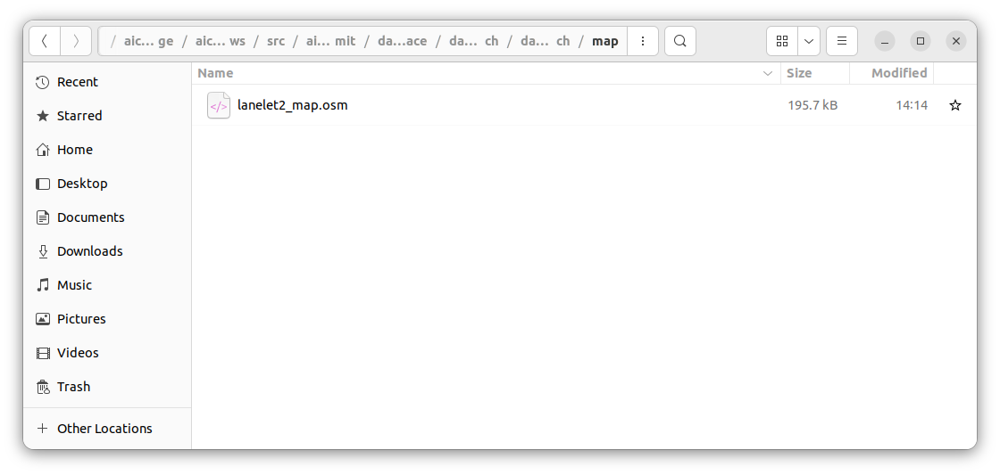

# SetUp

<!--br>

> [!REGISTER]
> こちらから参加登録!
> [https://www.jsae.or.jp/jaaic/en/index.php](https://www.jsae.or.jp/jaaic/en/index.php)

<br> -->

## Minimum Hardware Requirements
本大会で使用していただくPCの動作環境として以下を推奨しております。

* OS: Ubuntu 22.04
* CPU: Intel Corei7 (8 cores) or higher
* GPU: NVIDIA Geforce RTX 1060 or higher
* Memory: 32 GB or more
* Storage: SSD 30 GB or higher

上記のスペックを満たすPCをご用意できない方は、下記の「PC2台で参加する方向け」のスペックをご参照ください。
#### 2台のPCを使用する方向け
#### Autoware PC
* OS: Ubuntu 22.04
* CPU: Intel Corei7 (4 cores) or higher
* GPU: NVIDIA Geforce GTX 1060 or higher
* Memory: 16 GB or higher
* Storage: SSD 10 GB or higher
* 詳細は[こちら](https://autowarefoundation.github.io/autoware-documentation/main/installation/)

#### AWSIM PC
* OS: Ubuntu 22.04
* CPU: Intel Corei7 (4 cores and 8 threads) or higher
* GPU: NVIDIA Geforce RTX 1060 or higher

※Autoware動作PCとAWSIM動作PCは、同じネットワーク内に配置してください。
配置できていれば、基本的には追加設定をすることなく、PC間のトピック通信は可能です。万が一、トピック通信ができなかった場合はファイアーウォールの解除、もしくはルールの見直しをお願いします。
  

## Minimum Hardware Requirements (Experimental)
本大会で使用していただくPCの動作環境としてサポートを十分に提供できない可能性がありますが、試験的に以下の構成のPCのみでも参加可能にしてく予定です。

* OS: Ubuntu 22.04
* CPU: Intel Corei7 (4 cores) or higher
* GPU: Intel HD Graphics (no NVIDIA GPUs)
* Memory: 16 GB or more
* Storage: SSD 30 GB or higher

    
## Environment Setup
### AWSIM(Ubuntu)
#### 事前準備
* (CPU onlyの方はskip) Nvidiaドライバのインストール
  1. リポジトリの追加
  ```
  sudo add-apt-repository ppa:graphics-drivers/ppa
  ```
  2. パッケージリストの更新
  ```
  sudo apt update
  ```
  3. インストール
  ```
  sudo ubuntu-drivers autoinstall
  ```
  4. 再起動の後、下記コマンドを実行し、インストールできていることを確認
  ```
  nvidia-smi
  ```
  
 
 * Vulkunのインストール
    1. パッケージリストの更新
    ```
    sudo apt update
    ```
    2. libvulkan1をインストール
    ```
    sudo apt install libvulkan1
    ```
 * コースの準備
   1. [GoogleDrive](https://drive.google.com/drive/folders/1EjgBxB_x0_xRla7_FdPaeEkiOU3vxW7e)から最新の`AWSIM.zip`をダウンロードし、`aichallenge2023-racing/docker/aichallenge`内に大会用AWSIM実行ファイルを展開
   2. パーミッションを図のように変更    
     
   3. ファイルをダブルクリックで起動
   4. GPU版のAWSIMは下記のような画面が表示されることを確認
      (CPU版のAWSIMは画面の描画なし)
      

### Dockerの事前準備  
下記のインストールをお願いします。
  * [docker](https://docs.docker.com/engine/install/ubuntu/)
  * [rocker](https://github.com/osrf/rocker) 
     * Dockerコンテナ内のRviz、rqtなどのGUIを使用するために用います。
  * (CPU onlyの方はskip)[Nvidia Container Toolkit](https://docs.nvidia.com/datacenter/cloud-native/container-toolkit/install-guide.html) 
  * [git lfs](https://packagecloud.io/github/git-lfs/install)
  
* Dockerイメージの準備・起動 〜 Autowareの準備
   1. Dockerイメージを入手
    ```
    REPOSITORY                                                                       TAG                                 IMAGE ID       CREATED          SIZE
    ghcr.io/automotiveaichallenge/aichallenge2023-racing/autoware-universe-no-cuda   latest                              9601fc85f1bd   3 weeks ago      7.31GB    
    ```

    2. 大会用データのダウンロード
    ```
    sudo apt install -y git-lfs
    git lfs clone https://github.com/AutomotiveAIChallenge/aichallenge2023-racing
    cd aichallenge2023-racing
    git submodule update --init --recursive
    ```
    3. 大会用dockerイメージのビルド
    ```
    cd aichallenge2023-racing/docker/train
    bash build_docker.sh
    ```
    4. 大会用dockerコンテナの起動
    
    GPU環境の方は以下
    ```
    bash run_container.sh
    ```
    CPUのみの環境の方は以下
    ```
    bash run_container_cpu.sh
    ```
#### Dockerコンテナ内でのAWSIM起動
DockerコンテナからAWSIMを起動したい場合は、Dockerイメージの準備手順(前述)に従ってDockerイメージを導入した後、以下の手順で行ってください。
  1. `aichallenge2023-racing/docker/aichallenge`内に大会用AWSIM実行ファイルを展開(以下、`aichallenge2023-racing/docker/aichallenge/AWSIM/AWSIM.x86_64`に配置されているものとします。)
  2. rockerを起動
   新たにterminalを開いて`docker image ls`で以下のようなimageが存在していることを確認してください。
   ```
REPOSITORY                                                                      TAG                                 IMAGE ID       CREATED          SIZE
aichallenge-train                                                               latest                              67a4d45d119d   16 minutes ago   7.37GB
   ```
   確認ができたら以下のコマンドでrockerを起動してください。
   ```
    cd ./aichallenge2023-racing/docker/train
    bash run_container.sh
   ```
   新たに開いたterminalで`docker images` で以下のようにdocker が存在していることを確認してください。
   ```
REPOSITORY                                                                      TAG                                 IMAGE ID       CREATED          SIZE
aichallenge-train                                                               latest                              67a4d45d119d   16 minutes ago   7.37GB   
```
  1. コンテナ内で以下を実行
   ```
    cd /aichallenge
    bash run_awsim.sh 
   ```

> [!NOTE]
> AWSIMからpublish・subscribeされているトピックのメッセージは，一部`/aichallenge/aichallenge_ws/src/sim-msgs`で定義されています．これらのメッセージを扱うには，以下のコマンドを実行してください．
> ```
> cd /aichallenge
> bash build_autoware.sh
> source /aichallenge/aichallenge_ws/install/setup.bash 
> ```

### 地図データ(pcd, osm)のコピー WIP



`/aichallenge2023-racing/docker/aichallenge/aichallenge_ws/src/aichallenge_submit/dallara_interface/dallara_launch/dallara_launch/*`に配置されているosmファイルを`aichallenge2023-racing/docker/aichallenge/mapfile`にコピーして、ファイル構成が以下になるように配置してください。
```
aichallenge2023-racing
└ docker
 └ aichallenge
  └ AWSIM
  └ mapfile
   ├ .gitkeep
   ├ lanelet2_map.osm
```

### Autoware      
 * Autowareの動作確認  
   AWSIMを用いて、Autowareの動作確認を行う方法を記します。
   1. AWSIMを起動
   2. Autowareを起動
   ```
   # Rockerコンテナ内で
   cd /aichallenge
   bash build_autoware.sh
   ```
   3. 下記のような画面(Rviz2)が表示されることを確認  
      
            
   4. タブにある2D Goal Poseを選択し、ゴールポジションをドラッグで指定。画像のように、ルートが表示されている かつ `Routing`が`UNSET`から`SET`に変わっていることを確認（指定してから少し時間がかかります）  
     

### 2回目以降の起動
1. AWSIMの起動
   1. コンテナの起動
   ```
    cd ./aichallenge2023-racing/docker/train
    bash run_container.sh または bash run_container_cpu.sh
   ```
   2. コンテナ内部でAWSIMの起動
   ```
    cd /aichallenge
    bash run_awsim.sh 
   ```
2. Autowareの起動
   1. コンテナの起動
   ```
    cd ./aichallenge2023-racing/docker/train
    bash run_container.sh または bash run_container_cpu.sh
   ```
   2. 必要に応じてコンテナ内部でAutowareのbuild
   ```
    cd /aichallenge
    bash build_autoware.sh 
   ```
   3. コンテナ内部でAutowareの起動
   ```
    cd /aichallenge
    bash run_autoware.sh
   ```
### 画面録画の方法

デフォルトのrockerではディスプレイドライバを自分のPCに設定できていないため以下のオプションを追加する必要があります。
```
#!/bin/bash
rocker --device /dev/dri --x11 --user ... # CPU版
rocker --device /dev/dri --nvidia --x11 --user ... # GPU版
```
