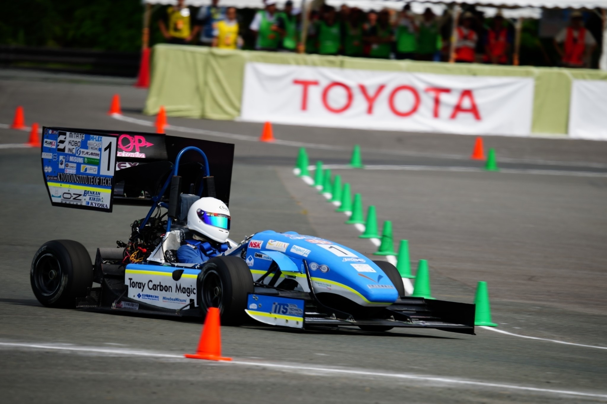
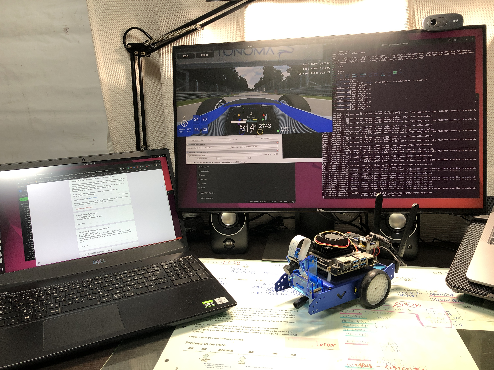

# Teams

 

本ページでは、予選大会に参加したチームの紹介を行います．

 

| Team Name | Photo  | Introduction about your team | Aspirations as a team |
| :-----: | :-----: | :----- | :----- |
| のーはんどわくわくれーさーず64 |   | 初めまして!! のーはんどわくわくれーさーず64の岡本健太です．チームメンバーは2人で後輩を無理やり連れてきました．私たちは京都工芸繊維大学で学生フォーミュラという活動をやっていました．しかしながら，2人ともソフトウェアには疎くAWSIM，Autowareは初めてで，後輩はROSも触ったことないです．車両運動に関しては自信がありますが自動運転に関しては全くの素人なのでお手柔らかに!!ちなみに岡本はOUXT-Polarisという自律航行船の開発チームにも所属していて自動運転の勉強中!! チーム名はChatgptに考えてもらいましたがセンスがなさ過ぎて，適当に組み合わせてこうなりました!よろしくお願いします | 暴走車両にご注意ください!! |
| Team Valent |  | みなさま、こんにちは、Team Valentです。 自動運転AIチャレンジ大会に参加できる機会を頂き、大変感謝しております。私達のチーム構成は、実装を主に担当する私と、GPUマシンの提供およびアドバイザの息子の計２名です。自動運転技術に興味があり、Jetbot を Deep Neural Network を使って動かすことに取り組んでおり、皆様とともにこの大会を通じて様々な知識やスキルを学び成長し、そして、本大会に貢献できたらと考えております。よろしくお願いいたします。  Hello everyone, this is Team Valent. We are very grateful for the opportunity to participate in the Automated AI Challenge competition.  Our team consists of two people: myself, who is mainly responsible for the implementation, and my son, who is the GPU machine provider and advisor.  We are interested in automated driving technology and are working on Jetbot using Deep Neural Network.  I look forward to working with you all to learn and grow in knowledge and skills through this competition. | 実装するアルゴリズムとして、ディープニューラルネットワークのCNNだけではなく、Transformer などの比較的新しい技術を学んで実装してみたいと考えております。   As for algorithms to be implemented, we would like to learn and implement relatively new technologies such as Transformer as well as CNN for deep neural networks. |
| Team ACE | | Passionate about using tech to make positive impact. | Hear to learn and try new things/ideas. |
| | | | |
