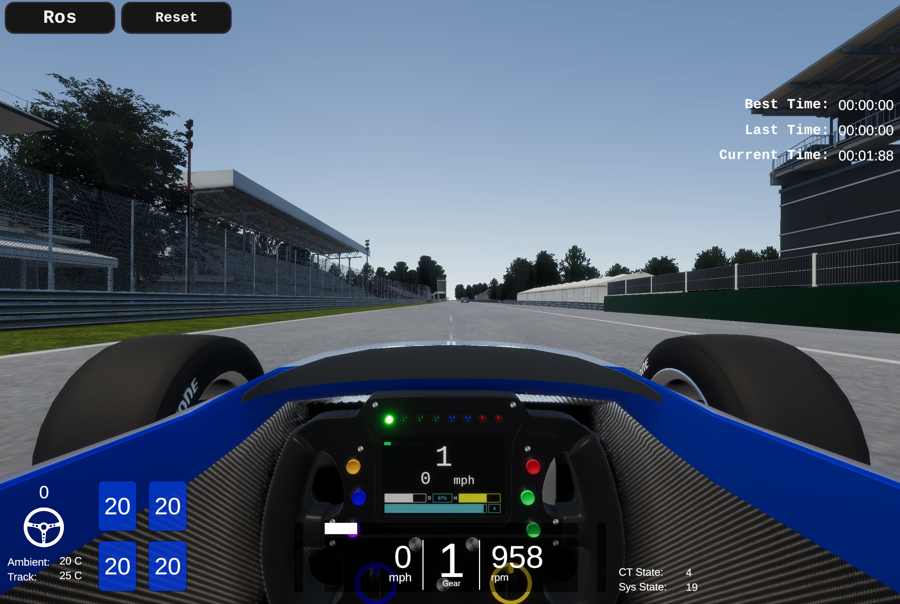

# SetUp

<br>

> [!REGISTER]
> こちらから参加登録!
> [https://www.jsae.or.jp/jaaic/en/index.php](https://www.jsae.or.jp/jaaic/en/index.php)

<br>

## Minimum Hardware Requirements

* OS: Ubuntu 22.04
* CPU: Intel Corei7 (8 cores) or higher
* GPU: NVIDIA Geforce RTX 1060 or higher
* Memory: 32 GB or more
* Storage: SSD 30 GB or higher

### For Those Using Two PCs
#### Autoware PC
* OS: Ubuntu 22.04
* CPU: Intel Corei7 (4 cores) or higher
* GPU: NVIDIA Geforce GTX 1060 or higher
* Memory: 16 GB or higher
* Storage: SSD 10 GB or higher
* Details[Here](https://autowarefoundation.github.io/autoware-documentation/main/installation/)

#### AWSIM PC
* OS: Ubuntu 22.04
* CPU: Intel Corei7 (4 cores and 8 threads) or higher
* GPU: NVIDIA Geforce RTX 1060 or higher

※"Please place the Autoware operation PC and the AWSIM operation PC within the same network. If they are properly configured, topic communication between PCs is possible without any additional settings. If, by any chance, topic communication is not possible, please disable the firewall or review its rules."
  

### For Those Using CPU Only PCs
#### Minimum Hardware Requirements for Headless mode
"We may not be able to fully support the operational environment of PCs used in this competition. However, to encourage more people to participate in the contest and engage in active discussions, we have experimentally made it possible to participate with the following CPU-only configuration.

* OS: Ubuntu 22.04
* CPU: Intel Core i7-8650U (4 cores) with Intel HD Graphics (no NVIDIA GPUs)
* Memory: 16 GB or more
* Storage: SSD 16 GB or higher

- other CPU only cases

* CPU : AMD Ryzen 5 5600G with Radeon Graphics
* Memory : 32GB

* CPU AMD® Ryzen 7 pro 4750u with radeon graphics × 16
* Memory 32.0 GiB

* DELL XPS 13 9300
* CPU: Intel(R) Core(TM) i7-1065G7
* Memory: 16GB
    
## Environment Setup
### AWSIM(Ubuntu)
#### preparation
* (Skip this step if you are using a CPU only or already have NVIDIA Driver installed) Installing Nvidia drivers.
  1. add repo、update、install
  ```sh
  sudo add-apt-repository ppa:graphics-drivers/ppa
  sudo apt update
  sudo ubuntu-drivers autoinstall
  ```
  2. after restart、make sure you can run below command
  ```
  nvidia-smi
  ```
  
 
 * install Vulkun
    1. update package list
    ```sh
    sudo apt update
    sudo apt install libvulkan1
    ```
 * prepare curse
   1. [GoogleDrive Download Link](https://drive.google.com/drive/folders/1EjgBxB_x0_xRla7_FdPaeEkiOU3vxW7e) place `AWSIM.zip` to　`aichallenge2023-racing/docker/aichallenge`
   2. permission change    
     
   3. double click file to run simulator
   4. Ensure that the GPU version of AWSIM displays a screen like the one shown below.
      (CPU version of AWSIM does not displays anything)
      

### Docker Preparation  
Install below
  * [docker](https://docs.docker.com/engine/install/ubuntu/)
  * [rocker](https://github.com/osrf/rocker) 
     * This is used for running GUI applications like Rviz, rqt, etc., inside Docker containers.
  * [git lfs](https://packagecloud.io/github/git-lfs/install)

The following commands will install docker, rocker, and git lfs.
```sh
sudo apt-get update
sudo apt-get install ca-certificates curl gnupg
sudo install -m 0755 -d /etc/apt/keyrings
curl -fsSL https://download.docker.com/linux/ubuntu/gpg | sudo gpg --dearmor -o /etc/apt/keyrings/docker.gpg
sudo chmod a+r /etc/apt/keyrings/docker.gpg
echo \
  "deb [arch="$(dpkg --print-architecture)" signed-by=/etc/apt/keyrings/docker.gpg] https://download.docker.com/linux/ubuntu \
  "$(. /etc/os-release && echo "$VERSION_CODENAME")" stable" | \
  sudo tee /etc/apt/sources.list.d/docker.list > /dev/null
sudo apt-get update
sudo apt-get install docker-ce docker-ce-cli containerd.io docker-buildx-plugin docker-compose-plugin
sudo docker run hello-world

# rocker install
sudo apt-get install python3-rocker

# gitlfs install
curl -s https://packagecloud.io/install/repositories/github/git-lfs/script.deb.sh | sudo bash
sudo apt-get install git-lfs
git lfs install
```

  * (For those who use CPU only PC skip this step)[Nvidia Container Toolkit](https://docs.nvidia.com/datacenter/cloud-native/container-toolkit/install-guide.html)

```sh
distribution=$(. /etc/os-release;echo $ID$VERSION_ID) \
      && curl -fsSL https://nvidia.github.io/libnvidia-container/gpgkey | sudo gpg --dearmor -o /usr/share/keyrings/nvidia-container-toolkit-keyring.gpg \
      && curl -s -L https://nvidia.github.io/libnvidia-container/$distribution/libnvidia-container.list | \
            sed 's#deb https://#deb [signed-by=/usr/share/keyrings/nvidia-container-toolkit-keyring.gpg] https://#g' | \
            sudo tee /etc/apt/sources.list.d/nvidia-container-toolkit.list

sudo apt-get update
sudo apt-get install -y nvidia-container-toolkit
sudo nvidia-ctk runtime configure --runtime=docker
sudo systemctl restart docker

sudo docker run --rm --runtime=nvidia --gpus all nvidia/cuda:11.6.2-base-ubuntu20.04 nvidia-smi


# +-----------------------------------------------------------------------------+
# | NVIDIA-SMI 450.51.06    Driver Version: 450.51.06    CUDA Version: 11.0     |
# |-------------------------------+----------------------+----------------------+
# | GPU  Name        Persistence-M| Bus-Id        Disp.A | Volatile Uncorr. ECC |
# | Fan  Temp  Perf  Pwr:Usage/Cap|         Memory-Usage | GPU-Util  Compute M. |
# |                               |                      |               MIG M. |
# |===============================+======================+======================|
# |   0  Tesla T4            On   | 00000000:00:1E.0 Off |                    0 |
# | N/A   34C    P8     9W /  70W |      0MiB / 15109MiB |      0%      Default |
# |                               |                      |                  N/A |
# +-------------------------------+----------------------+----------------------+
# +-----------------------------------------------------------------------------+
# | Processes:                                                                  |
# |  GPU   GI   CI        PID   Type   Process name                  GPU Memory |
# |        ID   ID                                                   Usage      |
# |=============================================================================|
# |  No running processes found                                                 |
# +-----------------------------------------------------------------------------+

```


Certainly, here's the translation of the provided text in the requested format:

* Preparing & Starting the Docker Image - Setting up Autoware
   1. Obtaining the Docker Image
   ```
   docker pull ghcr.io/automotiveaichallenge/aichallenge2023-racing/autoware-universe-no-cuda
   ```
   Add your account to the user group
   ```
   sudo usermod -aG docker $USER
   ```
   Confirm that docker has been added to groups with the following command
   ```
   groups $USER
   # $ USERNAME : USERNAME adm cdrom sudo ... docker
   ```
   Once confirmed, re-login

   Check that the following display is visible in docker images
    ```
    REPOSITORY                                                                       TAG                                 IMAGE ID       CREATED          SIZE
    ghcr.io/automotiveaichallenge/aichallenge2023-racing/autoware-universe-no-cuda   latest                              9601fc85f1bd   3 weeks ago      7.31GB    
    ```

    2. Downloading Competition Data
    ```
    sudo apt install -y git-lfs
    git lfs clone https://github.com/AutomotiveAIChallenge/aichallenge2023-racing
    ```
    3. Building the Competition Docker Image
    ```
    cd aichallenge2023-racing/docker/train
    bash build_docker.sh
    ```
    4. Starting the Competition Docker Container
    
    For GPU environments
    ```
    bash run_container.sh
    ```
    For CPU only environments
    ```
    bash run_container_cpu.sh
    ```

Certainly! Here is the translation of your text in the same format:

#### Starting AWSIM in a Docker Container
If you want to start AWSIM from a Docker container, follow the Docker image preparation steps (described previously) to install the Docker image, and then proceed with the following steps:
  1. Extract the competition's AWSIM executable file into `aichallenge2023-racing/docker/aichallenge` (for the purposes of this guide, we will assume it's located at `aichallenge2023-racing/docker/aichallenge/AWSIM/AWSIM.x86_64`).
  2. Start rocker
     Open a new terminal and confirm that an image like the one below exists with `docker image ls`.
   ```
REPOSITORY                                                                      TAG                                 IMAGE ID       CREATED          SIZE
aichallenge-train                                                               latest                              67a4d45d119d   16 minutes ago   7.37GB
   ```
   Once confirmed, start rocker with the following commands.  

   For GPU environments
   ```
    cd ./aichallenge2023-racing/docker/train
    bash run_container.sh
   ```
   For CPU-only environments
   ```
    cd ./aichallenge2023-racing/docker/train
    bash run_container_cpu.sh
   ```
   In the new terminal, confirm that docker exists as shown below with `docker images`.
   ```
REPOSITORY                                                                      TAG                                 IMAGE ID       CREATED          SIZE
aichallenge-train                                                               latest                              67a4d45d119d   16 minutes ago   7.37GB   
```
  3. Execute the following inside the container
   ```
    cd /aichallenge
    bash run_awsim.sh 
   ```

> [!NOTE]
> The messages published and subscribed by AWSIM are partially defined in `/aichallenge/aichallenge_ws/src/sim-msgs`. To handle these messages, please execute the following commands.
> ```
> cd /aichallenge
> bash build_autoware.sh
> source /aichallenge/aichallenge_ws/install/setup.bash 
> ```

Certainly! Here's the translation of the provided text in the same format:

### Placement of Map Data OSM Work in Progress (WIP)

For this competition, we have allowed modifications to the lanelet2_map file. Please place it in `/aichallenge2023-racing/docker/aichallenge/aichallenge_ws/src/aichallenge_submit/aichallenge_submit_launch/map/*`, ensuring the file structure is as follows:
```
aichallenge2023-racing
└ docker
 └ aichallenge
  └ AWSIM
  └ aichallenge_ws/src/aichallenge_submit/aichallenge_submit_launch
     └map
      └lanelet2_map.osm
```
※ There are no constraints such as having to refer to the lanelet2_map for route planning (referring to a csv file to generate routes is also permissible).
※ PCD files are included, but there is no need to submit them this time. Use them only if necessary for editing the map.

### Autoware      
 * Checking Autoware Operation  
   Here we describe how to check Autoware's operation using AWSIM.
   1. Start AWSIM
   2. Start Autoware
   ```
   # Inside the Rocker container
   cd /aichallenge
   bash build_autoware.sh
   bash run_autoware.sh
   ```
   3. Ensure that a screen like Rviz2 is displayed as shown below  
      
            
   4. Select 2D Goal Pose in the tab, specify the goal position by dragging. Confirm that the route is displayed as in the image and that `Routing` changes from `UNSET` to `SET` (it takes a little time after specifying)  
     

### Starting from the Second Time Onwards
1. Starting AWSIM
   1. Start the container
   ```
    cd ./aichallenge2023-racing/docker/train
    bash run_container.sh or bash run_container_cpu.sh
   ```
   2. Start AWSIM inside the container
   ```
    cd /aichallenge
    bash run_awsim.sh 
   ```
2. Starting Autoware
   1. Start the container
   ```
    cd ./aichallenge2023-racing/docker/train
    bash run_container.sh or bash run_container_cpu.sh
   ```
   2. Build Autoware inside the container if necessary
   ```
    cd /aichallenge
    bash build_autoware.sh 
   ```
   3. Start Autoware inside the container
   ```
    cd /aichallenge
    bash run_autoware.sh
   ```
### How to Record the Screen

The default rocker setup doesn't set the display driver to your own PC, so you need to add the following options:
```
#!/bin/bash
rocker --device /dev/dri --x11 --user ... # For CPU version
rocker --device /dev/dri --nvidia --x11 --user ... # For GPU version
```

### Incorporating Changes

#### Updating Docker
```sh
docker pull ghcr.io/automotiveaichallenge/aichallenge2023-racing/autoware-universe-no-cuda
```

#### Updating the Repository
```sh
cd aichallenge2023-racing # path to aichallenge2023-racing
git pull origin/main
```